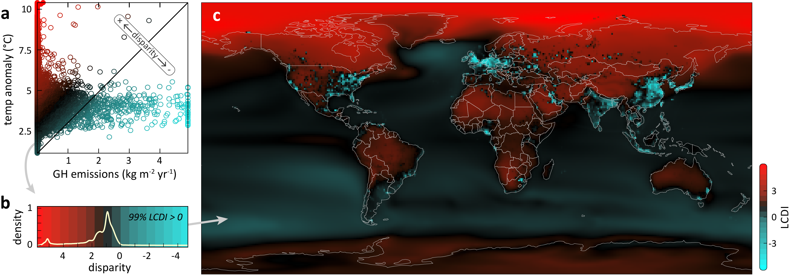

# climate_geographic_disparity

Data and code for **"The geographic disparity of historical greenhouse emissions and projected climate change,"** published open access in *Science Advances* (2021).

[](https://doi.org/10.1126/sciadv.abe4342)
[](https://osf.io/b53fy/)
[](LICENSE)
[](https://www.r-project.org/)

> Van Houtan KS, Tanaka KR, Gagné TO, Becker SL (2021) The geographic disparity of historical greenhouse emissions and projected climate change. *Science Advances* 7(29):eabe4342. https://doi.org/10.1126/sciadv.abe4342

---

## Abstract

One challenge in climate change communication is that the causes and impacts of global warming are unrelated at local spatial scales. Using high-resolution datasets of historical anthropogenic greenhouse emissions and an ensemble of 21st century surface temperature projections, we developed a spatially explicit index of local climate disparity. This index identifies positive (low emissions, large temperature shifts) and negative disparity regions (high emissions, small temperature shifts), with global coverage. Across all climate change projections we analyzed, 99% of the earth's surface area has a positive index value. This result underscores that while emissions are geographically concentrated, warming is globally widespread. From our index, the regions of the greatest positive disparity appear concentrated in the polar arctic, Central Asia, and Africa, with negative disparity regions in western Europe, Southeast Asia, and eastern North America. Straightforward illustrations of this complex relationship may inform on equity, enhance public understanding, and increase collective global action.

---

## The Local Climate Disparity Index (LCDI)

<p align="center">
  
</p>

The LCDI quantifies, for every 1° × 1° cell of the planet, the local mismatch between *who emits* and *who warms*. It is computed as the perpendicular distance of each cell from the diagonal of the emissions–temperature relationship (see `scripts/clean_scripts/2_Calculate_LCDI.R`):

- **Positive LCDI** (red): more projected warming than local emissions would imply — e.g. the polar Arctic, Central Asia, much of Africa.
- **Negative LCDI** (cyan): more local emissions than projected warming — e.g. western Europe, East Asia, eastern North America.

Across all four scenario × period combinations, the positive-to-negative area ratio is roughly **99:1** globally. The banner above is the global LCDI field (RCP 8.5, 2050–2099) rendered directly from `data/LCDI_RCP8.5_2050-2099.csv`.

---

## Repository structure

```
climate_geographic_disparity/
├── clim_geo_disp.Rproj         # RStudio project (anchors relative paths)
├── README.md
├── LICENSE                     # MIT
├── header.png                  # banner (global LCDI map, from repo data)
├── data/                       # input grids, shapefiles, and reference tables
│   ├── CMIP5 ENSMN RCP4.5 / RCP8.5 *.nc   # surface-temperature anomaly grids
│   ├── gpw/                    # CIESIN gridded population of the world v4
│   ├── TEOW/                   # terrestrial ecoregions (Olson et al. 2001)
│   ├── MEOW_2/                 # marine ecoregions/realms (Spalding et al. 2007)
│   ├── EEZ_land_union/         # national borders incl. EEZs (Marine Regions)
│   ├── KNMI/                   # KNMI CMIP5 tas difference grids (RCP4.5 / 8.5)
│   ├── UNDP_Indices/           # income index & multidimensional poverty index
│   └── *.csv / *.RData         # derived LCDI grids and lookup tables
├── scripts/
│   ├── clean_scripts/          # the canonical two-step pipeline
│   ├── data_curating/          # per-source ingestion of raw emission/climate data
│   ├── exploratory/            # experimental analyses (not in the final paper)
│   └── retired/                # superseded earlier versions
└── outputs/                    # combined emission layers + regional LCDI summaries
    ├── *.RData                 # intermediate model objects
    ├── previous results/       # earlier model runs + regional quantile CSVs
    ├── ocean_land/             # land/ocean-partitioned intersection results
    └── with SO2/               # sensitivity run including sulfur dioxide
```

---

## Data

The large raw emission and climate source files are **hosted on the Open Science Framework, not GitHub**, because of their size. The mirror at **https://osf.io/b53fy/** holds the full data tree; `scripts/kvh.R` documents the download and folder-setup steps. The GitHub repository carries the CMIP5 anomaly grids, the regional boundary shapefiles, the reference tables, and the derived outputs needed to reproduce the figures.

### Primary inputs

| Dataset | Variable | Source | Native resolution |
|---|---|---|---|
| EDGAR v5.0 | CO₂ (excl. + org. short-cycle), CH₄, N₂O | Emission Database for Global Atmospheric Research | 0.1° × 0.1° |
| MERRA-2 (BCEMAN) | Anthropogenic black carbon | NASA GES-DISC / Giovanni | 0.5° × 0.625° |
| CMIP5 ENSMN | Surface-temperature anomalies | NOAA ESRL Climate Change Portal | 1° × 1° |

Emission agents are aligned to CO₂-equivalents using the average of the 20- and 100-year **global temperature potential (GTP)** values before summation: in code these appear as multipliers of **CH₄ × 40.5**, **N₂O × 290.5**, and **BC × 400** (MERRA-2 BC is bilinearly resampled to the EDGAR grid first). Temperature anomalies span the **RCP 4.5** (32 models) and **RCP 8.5** (37 models) scenarios over **2006–2055** and **2050–2099**, relative to a **1956–2005** baseline.

### Regional boundaries and auxiliary data

| Layer | Used for | Source |
|---|---|---|
| `TEOW/` | Terrestrial biomes | Olson et al. 2001, *BioScience* |
| `MEOW_2/` | Marine realms | Spalding et al. 2007, *BioScience* |
| `EEZ_land_union/` | UN member states incl. EEZs | Marine Regions / Flanders Marine Institute |
| `rnaturalearth` (runtime) | US states, geopolitical subregions | South 2017 |
| `gpw/` | Population density (per-capita option) | CIESIN GPW v4.11 |
| `UNDP_Indices/` | Income & multidimensional poverty index | UNDP Human Development Report 2019 |

---

## Scripts

The **canonical pipeline** lives in `scripts/clean_scripts/` and runs in two steps:

| Step | Script | Purpose |
|---|---|---|
| 1 | `1_Develop_Global_Emission_Layer.R` | Build the unified GHG emission raster (EDGAR CO₂/CH₄/N₂O + GTP-weighting + MERRA-2 BC), saved as `BC_CO2_CH4_N2O_Combined_1970-2018.RData` |
| 2 | `2_Calculate_LCDI.R` | Load the emission layer + CMIP5 anomaly, winsorize each to the 99.9th percentile, compute the perpendicular-distance LCDI, render Figures 1–2, and intersect LCDI with TEOW / MEOW / EEZ / US-state / ocean–land boundaries |

Supporting scripts in `scripts/` reproduce the remaining figures and summaries:

- `LCDI_Density_Plot.R` — the global LCDI histogram (Fig. 2B: 99% > 0).
- `generate_LCDI_outputs.R`, `rank_spatial_units.R`, `plot_disparity_rankings_v2.R` — the regional ranking bar charts (Fig. 3: nations, biomes, anthromes, geopolitical regions, US states), ranked by the 10th LCDI quantile.
- `area_fraction_emissions_anomaly.R` — the emission/warming area-fraction statistics (e.g. <8% of surface generated 90% of emissions).
- `undp_lcdi.R` — the LCDI × income / poverty analysis.
- `compare_quantiles.R`, `plot_LCDI_osm.R`, `combine_EDGAR_GHG_MERRA2_BC_layers.R`, `match_anomaly_combined_emissions_layer_v2.R` — alternative builds and cross-checks.
- `data_curating/` — per-source ingestion of the raw inventories (EDGAR, MERRA-2, ODIAC, ECLIPSE BC, MPI-ESM, anthromes, shapefiles, cumulative CO₂).
- `exploratory/` and `retired/` — experimental or superseded code retained for provenance; **not** part of the published results.

---

## Reproducing the analysis

1. Install [R](https://www.r-project.org/) and open `clim_geo_disp.Rproj`.
2. Download the raw data tree from **https://osf.io/b53fy/** following the steps in `scripts/kvh.R`.
3. Install the package stack. The pipeline draws on:

   ```r
   install.packages(c(
     # raster + geospatial
     "raster", "sf", "sp", "rgdal", "ncdf4", "spatial.tools", "rmapshaper",
     "rnaturalearth", "rnaturalearthdata", "rnaturalearthhires",
     # wrangling + viz
     "tidyverse", "RColorBrewer", "colorRamps", "ggpubr", "ggridges",
     "ggdark", "cowplot", "DescTools", "maps"
   ))
   ```
   Note that `spatial.tools`, `rgdal`, and `rnaturalearthhires` are archived or non-CRAN and may need installation from source or a CRAN snapshot.
4. Run `clean_scripts/1_Develop_Global_Emission_Layer.R`, then `clean_scripts/2_Calculate_LCDI.R`, then the figure/ranking scripts.

---

## Notes and known issues

Documented here for transparency and future cleanup. This is an older, organically organized project, and the scripts were written against the original authors' machines.

- **Hard-coded absolute paths.** Many scripts read and write from machine-specific locations (e.g. `/Users/ktanaka/Desktop/...`, `G:/EDGAR_v5.0/...`, `~/clim_geo_disp/...`, `~/Desktop/`). These must be repointed to the local clone (and the OSF download) before anything will run. Converting them to `.Rproj`-relative paths is the main reproducibility fix.
- **`output/` vs `outputs/`.** `1_Develop_Global_Emission_Layer.R` saves to a singular `/clim_geo_disp/output/` directory, while `2_Calculate_LCDI.R` loads from the plural `~/clim_geo_disp/outputs/` (the directory that actually exists in this repo). The paths need to be reconciled.
- **Two small bugs in `2_Calculate_LCDI.R`.** The script resamples an undefined object `ge` (it should reuse the loaded `bc_co2_ch4_n2o_adjusted`), and its final `save()` lists `intersection_world`, which is never created. Both will error as written.
- **Raw source data live on OSF, not here.** The large EDGAR/MERRA-2 grids are at https://osf.io/b53fy/; only derived grids, shapefiles, and outputs are committed to GitHub.
- **LICENSE year.** The MIT `LICENSE` reads `Copyright (c) 2026`; the paper was published in 2021.
- **macOS cruft.** Committed `.DS_Store` files appear in the root, `scripts/`, and `outputs/`, and `.gitignore` contains a stray `NA` entry — both worth cleaning up.

---

## Related resources

- **Open Science Framework mirror (full data):** https://osf.io/b53fy/
- **Published article:** https://doi.org/10.1126/sciadv.abe4342

## License

Released under the MIT License — see [LICENSE](LICENSE). © Kyle Van Houtan.

## Contributors

Kisei R. Tanaka, Tyler O. Gagné, Sarah L. Becker, and Kyle S. Van Houtan. K.S.V.H. conceived the study; K.R.T., T.O.G., and S.L.B. curated data, built the pipelines, and ran the models; K.S.V.H. and K.R.T. generated the figures and wrote the manuscript.
